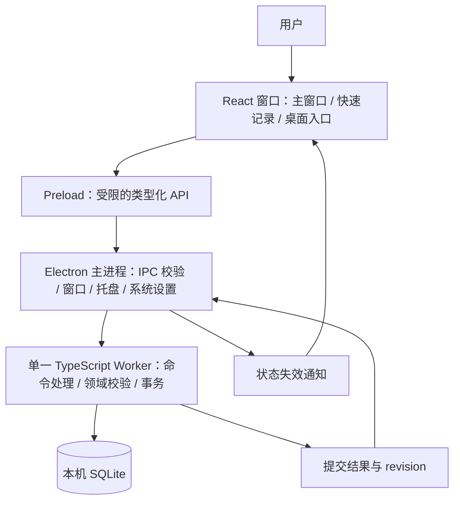
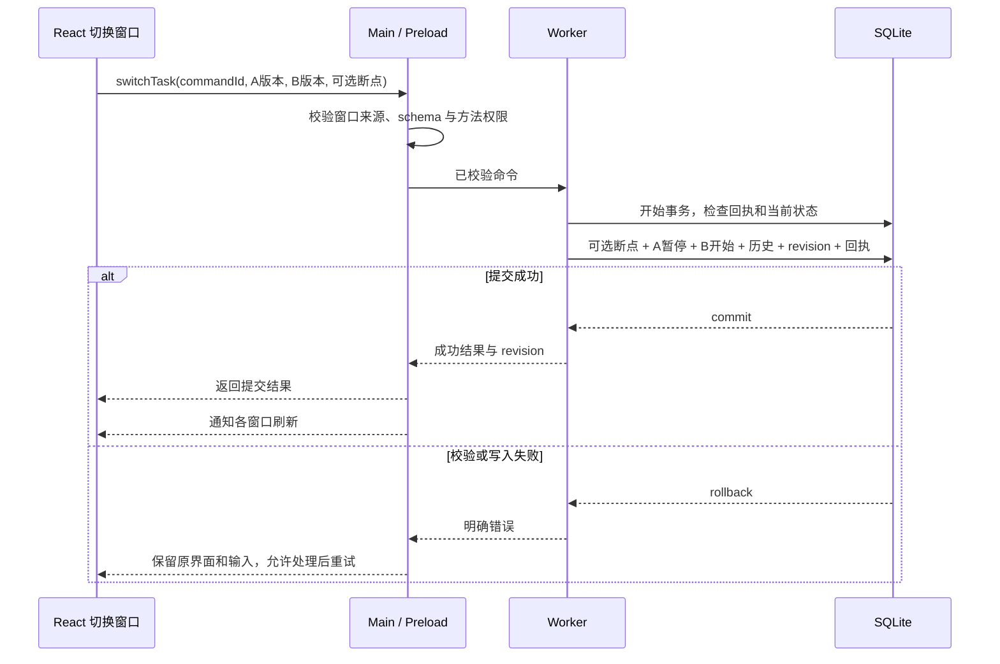

# 接着 PickUp MVP 软件架构设计

| 项目 | 内容 |
| --- | --- |
| 文档编号 | ARCH-001 |
| 版本 | v1.2 |
| 日期 | 2026-09-11 |
| 状态 | 架构设计基线；本地业务后端（命令、查询、草稿/偏好、迁移与故障处理）已实现并通过 Electron 集成与端到端检查；界面、桌面集成、性能与发布验收未完成。实现回写见第 21 节 |
| 需求依据 | [PRD v0.1](PRD.md)、[第一版交互原型](prototype.html) |
| 技术摘要 | [TECH-STACK.md](TECH-STACK.md) |
| 接口语义 | [IPC-CONTRACT.md](IPC-CONTRACT.md) |
| 已确认约束 | 用户要求业务开发全程使用 TypeScript，前端使用 React；团队不引入 Rust 维护负担 |
| 架构决定 | Electron + React + TypeScript + electron-vite + better-sqlite3 + SQLite |
| 适用范围 | 单用户、本地优先、Windows 桌面 MVP，覆盖 F01—F07 全部 P0 |

本文件用于工程初始化、模块开发和测试设计。PRD 决定产品规则；本文件决定实现边界。若原型行为与 PRD 不一致，以 PRD 为准。Windows 11 x64、小范围试用、手动更新是本稿采用的工程默认值，并非用户已逐项确认的产品承诺。框架相关官方资料见第 19 节。

实际实现范围、锁定版本和验证结果分别见 [ENGINEERING.md](ENGINEERING.md) 与 [VALIDATION.md](VALIDATION.md)。本架构的其他模块仍是待实施目标。

## 目录

1. 架构目标与范围
2. 技术栈与决定
3. 总体结构及职责
4. 窗口与应用生命周期
5. 领域模型和状态规则
6. 数据设计
7. IPC 与内部消息契约
8. 关键业务流程
9. 多窗口一致性
10. 保存、恢复和迁移
11. 安全与隐私
12. 性能和可访问性
13. 构建、测试环境与交付
14. 工程目录和依赖规则
15. 需求追踪与验收
16. 原型迁移清单
17. 实施顺序
18. 风险和待验证事项
19. 官方资料
20. 变更记录
21. 业务后端实现回写与澄清

## 1. 架构目标与范围

系统承接“记录新事项 → 暂停留断点 → 切换 → 完成 → 恢复 → 收尾”的闭环。

架构优先保证以下条件：

- 已确认保存的数据能在进程异常退出后恢复；写入失败保留输入并明确反馈。
- 同一数据库最多一件任务进行中，也允许没有当前任务。
- 创建、编辑、查看、选择下次事项均不自动开始任务。
- 主窗口、快速记录和桌面入口读取同一份已提交业务状态。
- 热唤起可输入 P95 ≤ 500 ms，常规保存和切换 P95 ≤ 1 s；按 PRD 指定规模实测。
- 用户操作节点驱动交互，隐藏窗口不高频轮询、不持续装饰动画、不周期提示。

MVP 不引入云服务、账号、同步协议、AI、通知调度、团队协作、全文检索、ORM、事件溯源或独立 HTTP 服务。数据导出和面向用户的备份维持 P1；升级前的数据库保护副本属于内部可靠性措施。

## 2. 技术栈与决定

| 层次 | 选型 | 采用方式 |
| --- | --- | --- |
| 桌面运行时 | Electron | 原生窗口、托盘、快捷键、单实例和应用生命周期 [R1][R3][R4] |
| 前端 | React + TypeScript | 函数组件与 Hooks；开启 strict 类型检查 |
| 构建 | electron-vite + Vite | 分别构建 main、preload、renderer 和数据库 worker [R5] |
| 包管理 | npm | 单 package.json、package-lock.json；CI 使用 npm ci |
| 样式 | 普通 CSS、CSS 变量、局部 CSS Modules | 延续原型视觉；需要隔离的组件使用 CSS Modules |
| 图标 | lucide-react | 本地打包；运行时不访问图标 CDN |
| UI 状态 | React 局部状态 + 一个共享快照模块 | useSyncExternalStore 订阅窗口内快照；初期不加 Redux/Zustand |
| 边界校验 | Zod | 共享请求 schema 与推导类型；主进程校验 IPC 输入 |
| 本地数据 | SQLite + better-sqlite3 | 一个 Node.js worker 持有一个连接，执行同步短事务 [R6] |
| 测试 | Vitest、React Testing Library、Playwright | 纯逻辑/组件测试、Electron 集成与桌面端到端验证；Electron 自动化支持状态见 [R10] |
| 打包 | electron-builder / NSIS | Windows x64 用户级安装，保留用户数据 [R11] |

**语言边界：** 应用、主进程、preload 和 worker 全部使用 TypeScript；样式和数据库迁移分别使用 CSS 与 SQL。Electron 和 better-sqlite3 含原生运行时/依赖，团队无需编写 Rust 或 C++。缺少目标版本的预编译模块时，构建机可能需要 C++ Build Tools 和 Python；终端用户不需要开发工具链。原生模块应匹配 Electron 的运行时和目标架构 [R7]。

**版本策略：** 工程初始化时选择相容的稳定版本，锁定精确依赖和开发 Node.js 版本。记录 Electron 所携带的 Node.js、Chromium 与 SQLite 实际版本。开发机 Node.js 与 Electron 内置 Node.js 分别管理；不依据开发机版本推断应用运行时能力。不使用浮动 latest 或预发布版本作为基线。

**决定理由：** Electron 满足团队的 TypeScript 维护要求；React 是用户明确选择。SQLite 适合当前本地单用户关系数据。better-sqlite3 的同步事务放入工作线程，可以保留顺序化实现，同时避免磁盘等待阻塞窗口和快捷键处理。保留一个具体数据访问模块，初期不设计多数据库适配接口。

## 3. 总体结构及职责



Electron 的单应用实例包含多个操作系统进程；数据库 worker 是 Node.js 工作线程，不是独立服务 [R1][R5]。

| 模块 | 职责 | 依赖边界 |
| --- | --- | --- |
| Renderer | 展示、表单、焦点、筛选、恢复区域、提交状态 | 只调用 window.pickup，不接触文件系统、SQL 或 Electron 原始 API |
| Preload | 通过 contextBridge 暴露固定业务方法和事件订阅 | 不承载任务状态规则；打包成自包含脚本，兼容沙箱 |
| Main | 校验来源与请求、转发 worker、管理窗口与系统 API、分发提交通知 | 不持有可独立修改的任务副本，不在消息处理中执行同步数据库操作 |
| Worker | 校验任务当前状态/版本、幂等处理、事务和查询、迁移 | 唯一数据库访问者；不调用 BrowserWindow 或 globalShortcut |
| Shared | DTO、请求 schema、错误码、状态枚举 | 不导入 Electron、React、数据库或操作系统 API |

系统设置涉及 OS 调用，由 main 协调；业务数据修改全部路由至 worker。worker 串行处理消息，事务函数内没有 await。数据库 worker 意外退出时停止接受新写入，保留 renderer 输入，提示重启恢复；MVP 不构造自动无限重启机制。

## 4. 窗口与应用生命周期

### 4.1 窗口定义

| 窗口 | 行为 |
| --- | --- |
| main | 工作台、状态列表、详情、设置和收尾；详情等先使用窗口内模态界面 |
| capture | 唯一快速记录窗口，所有“记一件事”入口唤起同一实例；隐藏预热，默认仅标题，备注可展开 |
| widget | 独立轻量桌面入口，可移动、收起、隐藏；默认不置顶，用户可开启置顶；仅在启用时创建 |

三个窗口共享同一 renderer 工程和组件，以固定窗口类型选择根组件。窗口类型由 main 创建登记；renderer 传入的查询参数不构成权限证明。

快速记录中的“现在处理”保存新任务后，在 capture 内复用切换组件；切换中返回或关闭只结束交互，新任务保留待处理。widget 上需要完整选择或填写的操作唤起 main 的对应流程。

主窗口默认使用系统标题栏；widget 可用受控拖动区域。避免为了还原原型而自建完整标题栏系统。尺寸和最小可用布局由设计走查确定。

### 4.2 启动和退出

1. 设置固定应用标识和 userData 路径策略，首先取得 requestSingleInstanceLock；未取得时退出，已有实例响应 second-instance 并展示入口 [R3]。
2. 启动 worker，打开数据库，完成迁移与校验，再允许业务写入。数据库失败时展示恢复错误页，不展示空白成功状态。
3. app ready 后注册本地资源协议、创建托盘和窗口；数据库初始化期间显示加载状态。
4. 恢复可持久化偏好和上次任务状态；创建隐藏的 capture，以供热唤起。
5. 主窗口关闭时隐藏至托盘；widget 关闭表示隐藏入口；这两种行为不改变任务状态。
6. 托盘提供“打开 PickUp”“记一件事”“完全退出”。完全退出设置退出标志，停止新命令，等待已接收命令和待保存草稿完成，再关闭 worker、注销快捷键和退出。
7. 若退出时仍有保存失败的输入，保留窗口并提示处理；强制退出和操作系统强制关机仅保证已经确认提交的数据，不承诺恢复未确认内容。

renderer 崩溃后可重建窗口并读取数据库；不根据 renderer 的残留内存覆盖数据库。

### 4.3 快捷键、焦点和窗口位置

- 默认快捷键建议 Ctrl+Alt+N，可修改。检查 globalShortcut.register 的返回结果；系统冲突时该 API 可能注册失败 [R4]。保留原可用快捷键及主窗口入口。
- 修改组合时先尝试注册新组合，保存偏好成功后注销旧组合；保存失败撤销新注册。相同组合按无变化处理。
- 唤起后显式聚焦标题。输入法合成期间 Enter 只提交候选字，不创建任务；正式提交由表单事件统一处理。
- 保存成功后隐藏 capture，由操作系统恢复焦点，尽可能回到原工作界面；跨应用强制焦点恢复不作为首版保证，也不为此引入自定义原生模块。
- 保存窗口 DIP 坐标、尺寸、收起/隐藏和置顶偏好；监听显示器增删、显示区域变化，恢复时按 screen 工作区校正并保留可操作区域。分辨率和缩放变化后仍可找到 widget。
- move/resize 保存采用事件结束后的去抖；隐藏/关闭前立即提交最终偏好，不做高频后台轮询。

## 5. 领域模型和状态规则

Task 使用 UUID 标识；允许同名标题。内部状态为 todo、doing、paused、waiting、done、cancelled，界面中文名称与 PRD 对应。

| 命令 | 来源 | 结果/约束 |
| --- | --- | --- |
| createTask | 新记录 | todo；不改变当前任务 |
| startTask | todo / paused / waiting | 无当前任务时进入 doing；已有其他当前任务时返回 NEED_SWITCH，不直接修改 |
| switchTask | doing + 可开始目标 | 原任务 paused、目标 doing，可附带原任务断点；一个事务 |
| pauseTask | doing | paused，可附断点；允许无下一任务 |
| markWaiting | todo / doing / paused | waiting，可选等待原因；原 doing 自然释放当前位 |
| resolveWaiting | waiting | todo；保留原断点和历史。**只接受 waiting**（命令来源前置条件见 21.9） |
| completeTask / cancelTask | 任意未结束状态 | done / cancelled；记录结束时间，清除命中的下次开工引用 |
| reopenTask | done / cancelled | todo，清空有效 ended_at，保留断点和状态历史；**只接受 done / cancelled**（命令来源前置条件见 21.9） |
| updateTask / saveBreakpoint | 编辑 / 显式保存断点 | 不改变状态；空断点不覆盖历史 |
| setNextUp | 指定未结束任务或清空 | 只修改全局可选引用，不开始任务 |

当前任务始终查询 status = doing，不保存另一份 current_task_id。最新断点按断点序号选取；原始进展、下一步和参考内容分别保存。单句输入映射到 next_step，进展和参考为可选字段。

恢复默认推荐最近进入 paused 的任务，按 status_changed_at DESC、status_revision DESC、id ASC 稳定排序。waiting 不参与默认推荐；“暂不开始”关闭本次恢复提示，不改变状态，不自动弹回。完成非当前任务只刷新列表，不触发强制恢复区域。

排序：todo 按 created_at ASC、id ASC；waiting 按状态进入时间降序；已结束按 ended_at DESC、status_revision DESC、id ASC。修改标题、备注、断点不修改 status_changed_at 或 status_revision。

## 6. 数据设计

### 6.1 存储与数据表

业务数据库位于 app.getPath('userData') 下的 data/pickup.sqlite；固定应用标识后保持路径稳定 [R3]。该目录不是安装目录，也不是同步目录。MVP 不开放用户改选数据库路径，不将其放入网络盘或云盘同步目录。

| 表 | 用途 |
| --- | --- |
| tasks | 当前任务内容、有效状态、有效结束时间和乐观并发版本 |
| breakpoints | 每次非空显式保存的断点，追加保留 |
| task_transitions | 创建及状态变化的轻量历史，支持重新打开后保留旧完成/取消记录 |
| app_state | 单行配置：下次开工引用、全局版本、草稿与偏好 |
| command_receipts | 已提交命令回执，支持结果丢失后的幂等重试 |

task_transitions 记录历史，不作为状态重放来源。查询当前状态直接读取 tasks；不建立事件溯源或独立读模型。

### 6.2 初始表结构基线

以下 SQL 是初始迁移的设计基线；初始化工程时应转为版本化迁移文件。时间采用 UTC Unix 毫秒整数。数据库约束作为领域校验的第二层保障。

```sql
PRAGMA foreign_keys = ON;
PRAGMA journal_mode = DELETE;
PRAGMA synchronous = EXTRA;
PRAGMA busy_timeout = 1000;

CREATE TABLE tasks (
  id TEXT PRIMARY KEY NOT NULL,
  title TEXT NOT NULL CHECK (length(trim(title)) > 0),
  note TEXT NOT NULL DEFAULT '',
  status TEXT NOT NULL CHECK (status IN ('todo','doing','paused','waiting','done','cancelled')),
  wait_reason TEXT NOT NULL DEFAULT '',
  created_at INTEGER NOT NULL,
  updated_at INTEGER NOT NULL,
  status_changed_at INTEGER NOT NULL,
  status_revision INTEGER NOT NULL CHECK (status_revision >= 1),
  ended_at INTEGER,
  version INTEGER NOT NULL DEFAULT 1 CHECK (version >= 1),
  CHECK ((status IN ('done','cancelled') AND ended_at IS NOT NULL)
      OR (status NOT IN ('done','cancelled') AND ended_at IS NULL))
);
CREATE UNIQUE INDEX ux_one_doing ON tasks(status) WHERE status = 'doing';
CREATE INDEX ix_tasks_state_order ON tasks(status, status_changed_at DESC, status_revision DESC);
CREATE INDEX ix_tasks_created ON tasks(status, created_at, id);
CREATE INDEX ix_tasks_ended ON tasks(status, ended_at DESC);

CREATE TABLE breakpoints (
  seq INTEGER PRIMARY KEY AUTOINCREMENT,
  task_id TEXT NOT NULL REFERENCES tasks(id) ON DELETE RESTRICT,
  progress TEXT NOT NULL DEFAULT '',
  next_step TEXT NOT NULL DEFAULT '',
  reference_text TEXT NOT NULL DEFAULT '',
  saved_at INTEGER NOT NULL,
  CHECK (length(trim(progress)) + length(trim(next_step)) + length(trim(reference_text)) > 0)
);
CREATE INDEX ix_breakpoints_task ON breakpoints(task_id, seq DESC);

CREATE TABLE task_transitions (
  seq INTEGER PRIMARY KEY AUTOINCREMENT,
  task_id TEXT NOT NULL REFERENCES tasks(id) ON DELETE RESTRICT,
  from_status TEXT CHECK (from_status IN ('todo','doing','paused','waiting','done','cancelled')),
  to_status TEXT NOT NULL CHECK (to_status IN ('todo','doing','paused','waiting','done','cancelled')),
  changed_at INTEGER NOT NULL,
  revision INTEGER NOT NULL CHECK (revision >= 1)
);
CREATE INDEX ix_transitions_task ON task_transitions(task_id, seq DESC);

CREATE TABLE app_state (
  singleton INTEGER PRIMARY KEY CHECK (singleton = 1),
  revision INTEGER NOT NULL DEFAULT 0 CHECK (revision >= 0),
  next_up_task_id TEXT REFERENCES tasks(id) ON DELETE RESTRICT,
  next_up_version INTEGER NOT NULL DEFAULT 0,
  draft_title TEXT NOT NULL DEFAULT '',
  draft_note TEXT NOT NULL DEFAULT '',
  draft_version INTEGER NOT NULL DEFAULT 0,
  preferences_json TEXT NOT NULL DEFAULT '{}',
  preferences_version INTEGER NOT NULL DEFAULT 0
);
INSERT INTO app_state(singleton) VALUES (1);

CREATE TABLE command_receipts (
  command_id TEXT PRIMARY KEY NOT NULL,
  command_type TEXT NOT NULL,
  payload_hash TEXT NOT NULL,
  result_json TEXT NOT NULL,
  committed_at INTEGER NOT NULL,
  revision INTEGER NOT NULL CHECK (revision >= 0)
);
```

条件唯一索引由 SQLite 原生支持 [R8]。外键仅保证任务引用存在，“next_up 必须是未结束任务”由所有相关写命令在同一事务内维护。标题空白和断点空白还需 TypeScript 按统一 trim 规则验证，SQL trim 不替代多语言输入校验。

应用默认值通过版本化初始化写入：桌面入口启用、置顶关闭、开机启动关闭、快捷键 Ctrl+Alt+N；无任务、无示例数据、无下次事项。preferences_json 使用明确 schema 和版本化默认值，按单个偏好字段更新，避免窗口间整对象覆盖。

### 6.3 事务规则

- 一个 worker、一个连接，消息顺序执行；采用 better-sqlite3 的事务函数，事务体完全同步 [R6]。
- 用户业务修改按“输入 schema 校验 → 开始事务 → 检查回执 → 检查版本/状态 → 修改数据 → 更新全局 revision → 写回执 → 提交”执行。回执查找在依赖当前状态的校验之前，确保重复已提交命令能返回历史结果。
- 同一事务内发生状态变化的任务共享该次 status_revision；任务内容、断点或状态实际变化时递增该任务 version 并更新 updated_at。版本号只用于排序和一致性，不代表时间。
- 数据库失败或业务校验失败时抛出错误回滚，任务、断点、历史、下次引用和回执共同撤销。
- 空断点不插入记录；跳过不改旧断点；切换失败不留下孤立断点。
- 不在事务内调用系统 API、等待用户输入或发送 IPC 事件。

### 6.4 日期语义

展示端按设备当前时区解释 UTC 时间。当天查询先在可信本地代码中计算本地零点到下一本地零点对应的 UTC 区间，使用左闭右开范围；不按固定 24 小时相加、不截取 ISO 字符串前缀。

本地日历日与本地零点交给**平台原生**的本地时区能力解释（`src/shared/local-date.ts` 使用 `Date` 的本地解释），不自行迭代推断时区偏移：本地零点不存在（时钟前跳）时当天从跳变后的第一个时刻开始；本地零点出现两次（时钟回拨）时取较早的实例。因此夏令时当天区间长度可能是 23、24 或 25 小时，且区间始终覆盖该本地日的全部时刻；相邻本地日的区间首尾相接。区间边界语义：`ended_at` 等于起点计入当天，等于终点属于次日。

当天完成默认统计“当前仍为 done 且 ended_at 在当天”的任务，取消不计入；重新打开后从当天完成列表移出，历史完成动作保留于 task_transitions。若产品需要展示全部历史完成动作，应另行调整统计口径。

窗口显示、获得焦点、系统恢复时重算日期/时区；可见收尾视图另设置一次性跨午夜刷新，并在日期变化后重新安排。设备改时间但页面持续可见时，以该事件/下一次操作或刷新纠正，不承诺无事件情况下即时察觉。日期变化本身不写任务状态。

## 7. IPC 与内部消息契约

Electron 采用 contextBridge + ipcRenderer.invoke / ipcMain.handle。preload 只暴露命名业务方法；不透传任意 channel，不暴露原始 ipcRenderer 或 IPC event [R2]。

### 7.1 请求和结果

```ts
type MutationMeta = { commandId: string };
type TaskRef = { taskId: string; expectedVersion: number };
type SwitchTaskInput = MutationMeta & {
  from: TaskRef;
  to: TaskRef;
  breakpoint?: { progress: string; nextStep: string; referenceText: string };
};
type AppErrorCode =
  | 'VALIDATION_ERROR' | 'NOT_FOUND' | 'STATE_CONFLICT' | 'NEED_SWITCH'
  | 'COMMAND_ID_REUSED' | 'STORAGE_ERROR' | 'DB_UNAVAILABLE'
  | 'SHORTCUT_CONFLICT' | 'SYSTEM_SETTING_ERROR' | 'OUTCOME_UNKNOWN';
type Result<T> =
  | { ok: true; value: T; revision: number }
  | { ok: false; code: AppErrorCode; retryable: boolean; message: string };
type StateChanged = { revision: number };
```

定义位于 shared/contracts.ts；输入 schema 与类型保持同一来源。main → worker 使用 requestId 关联单次消息，应答后移除 pending；requestId 与跨重试不变的 commandId 是两种标识。

| API 组 | 方法与关键输入 |
| --- | --- |
| 查询 | getWorkspaceSnapshot、listTasks（状态、分页）、getTaskDetail、getDailyReview（由 main 计算日期边界） |
| 创建/编辑 | createTask（commandId、标题、备注、draftVersion）；updateTask（TaskRef、标题、备注） |
| 调度 | startTask、switchTask、pauseTask、markWaiting、resolveWaiting |
| 结束 | completeTask、cancelTask、reopenTask |
| 断点 | saveBreakpoint（TaskRef、结构化可选字段） |
| 收尾 | setNextUp（目标/空、expectedNextUpVersion）；finishDailyReview（保留/暂停、预期当前任务及可选断点） |
| 草稿 | getDraft、saveDraft / clearDraft（expectedDraftVersion）；单一 capture 为编辑入口 |
| 设置 | getPreferences、updatePreference；系统设置由 main 协调执行 |
| 状态与事件 | getCommandResult（commandId）、onStateChanged（返回取消订阅函数） |
| 窗口 | showMain、showCapture、hideWidget、quit；由 main 执行，不接受任意文件路径或窗口脚本 |

已结束列表和断点历史按需分页。工作区快照包含当前任务、各状态计数、推荐摘要和下次事项，不携带全部历史正文。快照内各字段在一次一致读取中计算。

### 7.2 幂等与过期操作

- 在用户首次提交时产生 commandId，保存过程中重复按键复用同一提交，按钮同步禁用；重试保留原命令标识和规范化 payload。
- 持久化修改使用 command_receipts：命中相同 ID/类型/hash 时返回原结果；同 ID 不同内容返回 COMMAND_ID_REUSED。hash 由 schema 规范化后的字段按固定顺序计算；不把正文写入回执。
- 回执只保存成功结果的任务标识、结果类别和 revision。业务修改与回执同事务提交，初期保留回执，不做按时间删除而破坏重试保证。
- 可高频覆盖的草稿/位置采用版本条件更新并去抖，不逐键写命令回执；业务创建命令可同时按 draftVersion 清空已提交的草稿，避免清除更新输入。
- 编辑、切换和结束命令携带预期任务版本；由 worker 在事务中检查。两个窗口同时修改时，后一个收到 STATE_CONFLICT，保留输入并刷新，不静默覆盖。
- 主进程使用固定命令 allowlist 转发。不存在“直接设置任意状态”“执行 SQL”“读取任意文件”的 IPC 方法。

## 8. 关键业务流程

### 8.1 快速记录

1. 任一记录入口唤起唯一 capture，读取标题和备注草稿，聚焦标题。
2. Enter 默认 createTask；保存时不改变原当前任务，提交成功后关闭记录框。
3. “现在处理”仍先提交 createTask，成功后调用 startTask。
4. startTask 发现其他当前任务时返回 NEED_SWITCH，展示原任务及其断点；关闭切换后新任务仍在 todo。
5. Esc/关闭保留草稿，不创建任务。跨重启草稿仅承诺恢复最近已确认保存的草稿；新增输入仍受 PRD 的未确认边界约束。

草稿保存建议去抖 300 ms，关闭时 flush。写入失败保持 capture 内容和窗口可访问，不清空标题/备注。隐藏后的慢保存消息携带 draftVersion，避免下一次输入被旧消息覆盖。

### 8.2 保存并切换



来源已不是当前任务、目标已结束、任一版本过期均返回冲突。首次命令自选当前任务直接无变化，不产生重复开始或断点。已成功命令重试先命中回执，不因提交后的任务版本变化误报失败。

### 8.3 完成与恢复

completeTask 提交任务结束状态和历史，同时清除命中的 next_up 引用。结果中返回 wasCurrent。只有完成当前任务的操作窗口按该结果展示恢复流程，其他窗口刷新数据即可。

推荐本身不启动任务。点击推荐再次经 startTask，若当前位已被其他窗口占用则转正常切换。误完成通过 reopenTask 回到 todo，不抢占当前任务。结果提示与已结束列表均可提供重新打开入口。

### 8.4 每日收尾

收尾查询包含本日已完成、所有跨日未结束事项和显著展示的当前任务；每个数量能打开实际列表。选择下次事项即通过 setNextUp 保存，与结束收尾分开，文案明确“已保存选择”。候选包括所有未结束状态，允许选择当前任务。

结束收尾选择保留状态时不修改当前任务；选择暂停时携带当前任务版本，可填写断点，复用暂停事务。处理过程中如当前任务发生变化，保留收尾输入并重新展示最新状态。收尾页内编辑、完成、取消和补断点均复用已有命令；没有每日任务副本或隐式批量修改。

## 9. 多窗口一致性

数据库是唯一业务事实来源，renderer 仅缓存展示快照。

1. 窗口先订阅 stateChanged，再发起初次查询；组件卸载时释放订阅，开发 StrictMode 下也不重复注册。
2. 每个业务写事务递增 app_state.revision；返回结果与事件均携带 revision。重复回执不递增版本，不伪造新修改。
3. 所有窗口收到新版本后合并刷新请求；对某一查询键只接受最新请求序号的响应，丢弃低于已观察 revision 的业务结果，避免旧响应覆盖新状态。
4. 窗口重新显示/恢复时强制读取快照，补偿隐藏期间的事件遗漏。事件仅表达“数据已变化”，不作为业务状态持久来源。
5. 保存过程中显示进行中；只有提交确认后才显示成功。IPC 通知发送失败不将已提交事务描述为保存失败。
6. 超时或 worker 通信中断时标记 OUTCOME_UNKNOWN，保留输入，先查 commandId 回执；有回执返回成功，无回执且确认 worker/数据库已恢复后再按原 ID 重试。超时本身不等于回滚。

快照版本、任务版本和草稿/偏好版本分别解决展示顺序、业务冲突和高频配置覆盖，三者不互相替代。

## 10. 保存、恢复和迁移

### 10.1 持久化策略

本规模采用 SQLite DELETE 回滚日志、synchronous=EXTRA、foreign_keys=ON。EXTRA 在 DELETE 模式下比 FULL 增加日志删除后的目录同步保障 [R9]。低频单写场景优先简单可靠，暂不启用 WAL 或连接池。

数据库动作都在 worker 中执行。保存慢时 main 保持响应；超时显示进行中/结果待确认而不取消后台事务。磁盘损坏、设备丢失或操作系统/存储设备未兑现写入保证，不属于普通进程异常退出恢复承诺。

### 10.2 启动恢复

打开数据库后执行快速一致性检查和外键检查，验证 schema 版本。读取当前状态、断点、下次引用及偏好；不加载 prototype.html 的示例种子数据。

检查失败、文件只读、空间不足或权限错误时进入明确错误状态，保留原文件和用户输入。不得静默回退到空库、示例数据或内存成功状态。单实例锁应在打开数据库前取得；不同用户/开发环境使用各自数据目录。

### 10.3 版本迁移

- 使用按序 SQL 迁移和 PRAGMA user_version；应用声明可读写 schema 范围。
- 迁移前暂停业务访问，在同一 worker 中通过 SQLite backup API 生成一致副本；不要复制正在写入的数据库文件代替一致备份 [R6]。
- 备份成功并校验后执行单次升级事务；成功后更新 schema 版本。副本以升级版本/时间命名，轮换保留有限份数，建议最近两份。
- 迁移失败回滚，保留原文件与副本，展示诊断入口；不反复自动尝试破坏性修复。
- 应用发现数据库版本比自身支持范围新时停止写入，提示使用兼容版本。安装旧程序不等于数据库自动降级。
- 安装更新保留 userData；应用内完全退出前等待写入完成。面向用户的导出、设备备份和跨机恢复流程维持 P1。

### 10.4 系统偏好一致性

快捷键和开机启动涉及 OS 与 SQLite，不能用一个 SQLite 事务实现原子提交。main 串行处理系统偏好修改，worker 对偏好写入检查 expectedPreferencesVersion；普通窗口位置只更新所属窗口字段。main 采用“读取实际状态 → 应用目标设置 → 保存偏好 → 失败尝试恢复原设置”的顺序。

若恢复也失败，界面展示实际状态和错误；下次启动重新读回可查询的系统状态进行协调。开机启动默认关闭，在用户明确开启时调用 setLoginItemSettings；升级后验证启动路径仍有效 [R3]。偏好保存成功不代表系统设置必然成功。

## 11. 安全与隐私

以下是 Electron 本地应用的基础隔离边界 [R12]：

- 每个窗口设置 contextIsolation=true、nodeIntegration=false、sandbox=true、webSecurity=true；不启用 renderer worker 的 Node 集成。
- preload 构建为沙箱可执行的自包含脚本，除 Electron 允许的接口外不依赖运行时 require。业务 schema 在 main 校验，不为使用外部模块而关闭沙箱 [R5]。
- 使用固定本地 app 协议提供打包资源，路径解析限定在资源目录；拦截任意导航和新窗口。开发服务仅在开发模式允许固定来源。
- IPC 同时校验已登记的 webContents、主 frame、允许的本地 URL 与请求 schema。限制字段长度/消息大小，正文按文本呈现，不执行任务里的 HTML、脚本或文件路径。
- CSP 限定本地脚本/样式/图片，生产构建不开放 unsafe-eval；需要内联样式的地方按实际构建最小化配置。图标和必要视觉素材全部本地化。
- MVP 备注和参考内容按文本展示；若增加可点击链接，仅通过固定方法验证 http/https 协议后打开系统浏览器，不接受任意 shell 命令。
- 默认不发送正文、断点、屏幕、剪贴板或聊天数据。日志只记录命令类型、错误码、耗时和版本，不记录 payload、正文或完整文件路径。
- 数据库依赖当前 OS 用户目录访问控制，首版不单独实现数据库加密；离线和本地保存不等同于加密或设备备份。

## 12. 性能和可访问性

### 12.1 性能验证

| 项目 | 指标/方法 |
| --- | --- |
| 热唤起 | PRD P95 ≤ 500 ms；从 main 收到快捷键回调到 capture 标题实际获得可输入焦点，另用人工端到端观察覆盖 OS 按键入口 |
| 保存/切换 | PRD P95 ≤ 1 s；从用户提交到事务确认及界面结果可见，包含 IPC 与同步刷新 |
| 数据规模 | 1,000 件任务，每件最多 10 条短文本断点；属于首轮基准，不是产品硬上限 |
| 窗口组合 | 主窗口打开/隐藏、widget 打开/隐藏、capture 热唤起分别测量 |
| 资源观测 | 记录 Electron 全部进程总内存和 CPU；记录空闲、切换、多窗口三种场景，不只测 main |
| 长历史 | 列表默认分页 50 条，详情历史按需加载；不在每次刷新传输 10,000 条断点 |
| 冷启动 | 单独记录，不混入 PRD 已运行状态下的热唤起指标 |

首次基线建议 Windows 11 x64、四核 CPU、8 GB 内存、SSD，100% 与 150% 缩放；记录实际 CPU 型号、系统/应用版本和后台负载。自动化性能场景至少采集 100 次操作并报告 P50/P95/最大值；内存和安装包门槛待首个可安装版本实测后确定。

减少隐藏窗口渲染；默认去掉原型的无限波形动画。后台事件驱动，不禁用 Electron 默认后台节流来弥补实现问题。

### 12.2 键盘与辅助技术

表单保存使用明确提交事件，空标题在输入处提示；IME 合成键不触发提交。模态弹窗实现焦点陷阱、Esc 语义和关闭后焦点恢复。状态和错误同时用文字表达，图标有可访问名称，动态结果使用适当 live region。长文本支持截断与详情查看，常用缩放下操作按钮可见。

## 13. 构建、测试环境与交付

### 13.1 构建流水线

单仓库、单 npm 工程，main/preload/worker 构建产物与 renderer 静态资源分别输出。better-sqlite3 作为运行时依赖 externalize，保留模块和 .node 文件；worker 输出路径通过 electron-vite 的 worker 构建能力确定，校验打包后定位 [R5]。

顺序为：依赖安装 → 类型检查/静态检查 → 单元与组件测试 → 为目标 Electron 重建原生模块 → 构建 → Electron 集成验证 → NSIS 打包 → 安装后冒烟测试。

使用 Electron 官方说明的 @electron/rebuild 或打包工具相应机制，明确目标 Electron 版本和 x64 架构 [R7]。只保留一套重建入口。检查 ASAR 解包后的原生库可加载；不能以开发环境正常运行为安装包兼容证据。

electron-builder 稳定版配置在初始化时核对并锁定；不直接照用其 next 文档里的新增选项 [R11]。构建配置使用 TypeScript 配置文件或工具支持的声明式格式。

### 13.2 测试运行时边界

Vitest 用于 DTO/纯业务规则、排序/日期计算和 React Testing Library 组件测试。真实 SQLite 事务测试通过 **Electron 集成入口** 启动最终 worker，在独立临时 userData 中运行，避免 Node 与 Electron 原生 ABI 不匹配导致误判。

Playwright Electron 自动化覆盖主要窗口流程；该 API 官方标为 experimental [R10]，因此全局快捷键、系统托盘、开机启动、IME、多显示器和系统关机采用 Windows 实机专项验收。所有测试使用独立测试数据路径，禁止操作个人正式库。

### 13.3 安装与更新

默认 Windows 11 x64 的 NSIS 用户级完整安装包；包含 Electron 运行时，无 Tauri 的 WebView2 外部运行时前置要求 [R1]。运行时所有业务资源本地可用；安装包断网安装可作为验收场景，分发下载与签名信誉检查另行考虑。

初期通过完整安装包手动更新，升级保持应用标识及 userData 路径。卸载默认保留业务数据，不添加隐式清空数据行为。正式对外发布前落实 Windows 代码签名、发布渠道和版本发布说明；签名不保证消除全部系统信誉提示。自动更新服务维持后续范围。

## 14. 工程目录和依赖规则

以下是建议初始化结构，当前任务只产出文档，不表示文件已经实现。

```text
PickUp/
├─ docs/
│  ├─ PRD.md
│  ├─ TECH-STACK.md
│  ├─ ARCHITECTURE.md
│  └─ prototype.html
├─ src/
│  ├─ main/
│  │  ├─ index.ts             # 单实例、生命周期、初始化
│  │  ├─ windows.ts           # 三类窗口、位置、资源协议
│  │  ├─ system.ts            # 托盘、快捷键、开机启动
│  │  ├─ ipc.ts               # 来源校验、业务方法登记
│  │  └─ worker-client.ts     # 内部请求/响应关联
│  ├─ worker/
│  │  ├─ index.ts             # 顺序处理入口
│  │  ├─ commands.ts          # 领域规则、版本校验、幂等事务
│  │  ├─ queries.ts           # 快照、列表、详情、收尾查询
│  │  ├─ database.ts          # 连接、初始化、迁移
│  │  └─ migrations/001.sql
│  ├─ preload/index.ts        # 固定 window.pickup 接口
│  ├─ shared/
│  │  ├─ contracts.ts         # DTO / schema / 错误码
│  │  └─ task.ts              # 状态类型及纯规则
│  └─ renderer/src/
│     ├─ App.tsx
│     ├─ views/               # main / capture / widget / 收尾
│     ├─ components/          # 任务卡、详情、切换表单
│     ├─ state/workspace.ts   # 快照订阅、刷新和版本保护
│     └─ styles/
├─ tests/
│  ├─ unit/
│  ├─ integration/            # Electron + 真实 SQLite
│  └─ e2e/
├─ electron.vite.config.ts
├─ package.json
└─ package-lock.json
```

main 和 worker 通过 shared 契约通信，不互相导入执行入口；renderer 不导入 main/worker。建立分区 TypeScript 配置并在静态检查中限制越层导入。初期不拆 npm workspace、多 package、依赖注入容器或通用 repository 抽象。

## 15. 需求追踪与验收

| PRD | 实现落点 | 核心验收 |
| --- | --- | --- |
| F01 | capture、createTask、草稿版本 | Enter 稍后处理、中文 IME、备注草稿、同请求去重、原当前任务不变 |
| F02 | main/widget、快照广播 | 三窗口一致、隐藏入口、多显示器回到可见区域、长文本 |
| F03 | switchTask/pauseTask 事务 | 断点和两个状态一起提交/回滚、取消切换、自我切换无变化 |
| F04 | completeTask、推荐查询、reopenTask | 最近暂停推荐、waiting 排除、暂不开始、误完成恢复、不打断其他当前任务 |
| F05 | 状态命令与列表查询 | 状态转换表覆盖、等待转 todo、编辑不变排序、取消/重新打开 |
| F06 | 收尾查询、setNextUp、finishDailyReview | 跨日列表、当前任务候选、暂停或保留、开工引用有效性、日期重算 |
| F07 | worker/迁移、main 生命周期/system | 异常退出、写入失败、快捷键冲突、单实例、开机启动默认关闭 |

必须包含的故障测试：

1. 写入断点后、暂停 A 后、开始 B 后、写回执前分别注入异常，验证全事务回滚。
2. 事务提交成功后、IPC 应答前模拟中断，同 commandId 重试返回原结果，无重复任务/断点。
3. 两窗口同时开始不同任务、使用旧版本编辑/完成，验证最多一个 doing 且输入不丢失。
4. 完成/取消 next_up、重新打开、编辑暂停任务，验证引用清除、历史保留和排序不漂移。
5. 磁盘写满/只读、迁移失败、较新 schema、worker 退出，验证无虚假成功、无空库覆盖。
6. 100 次相同请求重放、两个真实独立同名创建，分别验证去重与合法同名保留。
7. 跨午夜、时区变化、DST 日期范围、退出重启，验证时间展示变化不修改任务状态。
8. 安装包环境的原生库加载、worker 路径、托盘退出、升级保留数据及快捷键注册。

发布阻断遵循 PRD：数据丢失、多个进行中任务、已结束事项丢失、持续干扰、关键保存失败重试失效均阻断发布。全部 P0 验收通过后才进入五个工作日试用。

## 16. 原型迁移清单

| 原型行为 | 工程要求 |
| --- | --- |
| localStorage 整对象写入，先改内存 | SQLite 事务提交确认，renderer 保留失败输入 |
| 开始和切换顺带改 nextUp | 独立保存用户选择，开始任务不覆盖它 |
| updated 同时作为暂停排序时间 | 使用 status_changed_at 和稳定次序 |
| 今日日期固定、断点仅 HH:mm | UTC 完整时间和本地日期范围查询 |
| capture 重开清空备注 | 标题和备注共同进入草稿 |
| 取消没有统一 ended_at | 完成和取消记录有效结束时间及状态历史 |
| 收尾排除 doing，缺少当天完成清单 | 补齐 F06 的列表、操作和两种收尾结果 |
| 设置只是布尔值、N 只在页面监听 | 实现系统快捷键、托盘、单实例和开机启动 |
| 外链图标/图片和无限动画 | 资源本地交付，减少空闲渲染 |
| 桌面入口没有独立实现 | 补齐可移动、收起、隐藏、置顶和位置恢复 |

原型保留为设计参考；提取视觉变量和布局到 React 组件。演示状态逻辑不直接作为生产业务服务；示例数据仅用于明确隔离的测试环境。

## 17. 实施顺序

| 阶段 | 产出 | 通过条件 |
| --- | --- | --- |
| M1 工程与桌面验证 | TS 工程、React 页面、worker/SQLite、可安装包、快捷入口 | 安装后 native 模块/worker 可用；初步测量热唤起与输入法 |
| M2 核心业务 | F01/F03/F04、数据库约束和回执、错误处理 | 创建→切换→完成→恢复及失败/重复请求用例通过 |
| M3 完整 P0 | F02/F05/F06/F07、窗口偏好、系统设置、跨日展示 | PRD 全部 P0 与多窗口专项通过 |
| M4 发布与试用 | 性能记录、迁移/升级验收、安装包、试用说明 | 发布阻断项清零，开展五个工作日试用 |

阶段仅用于控制实现顺序，P0 范围不缩减。完成 M1 的构建和安装验证后，再估算剩余工作量；本文件不承诺上线日期。

## 18. 风险和待验证事项

| 项目 | 当前处理 | 验证/决策点 |
| --- | --- | --- |
| 团队 Rust 经验有限 | 全部业务改为 TypeScript、React；Tauri/Vue 推荐已替换 | 已根据用户要求确定 |
| 原生依赖 ABI | 固定 Electron/better-sqlite3 组合、目标架构重建 | M1 安装后验证；必要时构建机配编译工具 |
| 同步 SQLite/磁盘等待 | 单 worker，main 不执行数据库调用 | 保存 P95 与故障注入 |
| Electron 多窗口资源占用 | capture 预热、widget 按需、摘要查询 | M1 记录总进程内存/CPU，再设量化门槛 |
| 最低系统和 CPU 架构 | 暂按 Windows 11 x64 | 若实际用户含 Windows 10/ARM64，扩展构建及测试矩阵 |
| 轻量入口交互 | 独立窗口，默认非置顶 | 补设计尺寸、收起形态、快捷键与 DPI 走查 |
| 系统设置非原子 | 应用/回滚/读回实际设置 | 注册冲突、保存失败、系统限制及升级路径专项 |
| 日期统计口径 | 当前有效 done，历史另存 | 产品要求历史完成统计时更新查询和验收 |
| 分发与签名 | 小范围手动安装，正式发布落实签名 | 发布渠道和证书由交付方确定 |
| 本地保存与设备备份 | 升级前保护副本；用户备份 P1 | 长期使用前复核导出/备份优先级 |

这些事项不阻塞文档基线和工程初始化；凡影响最低支持范围或发布承诺的项，需要在对应验收前落实，不视作已测试通过。

## 19. 官方资料

资料核对日期：2026-09-09。检索工具本次未返回可用内容，以下通过直接读取官方文档核对。描述用于支持架构能力选择，不构成“已在本项目验证”的声明。链接使用原始官方地址，具体依赖版本仍由工程锁文件确定。

- [R1] Electron 进程模型：`https://www.electronjs.org/docs/latest/tutorial/process-model`
- [R2] Electron IPC：`https://www.electronjs.org/docs/latest/tutorial/ipc`
- [R3] Electron app API：`https://www.electronjs.org/docs/latest/api/app`
- [R4] Electron globalShortcut：`https://www.electronjs.org/docs/latest/api/global-shortcut`
- [R5] electron-vite 开发指南（worker 与 preload 沙箱）：`https://electron-vite.org/guide/dev`
- [R6] better-sqlite3 API（事务与备份）：`https://raw.githubusercontent.com/WiseLibs/better-sqlite3/master/docs/api.md`
- [R7] Electron 原生模块：`https://www.electronjs.org/docs/latest/tutorial/using-native-node-modules`
- [R8] SQLite 条件唯一索引：`https://www.sqlite.org/partialindex.html`
- [R9] SQLite synchronous：`https://www.sqlite.org/pragma.html#pragma_synchronous`
- [R10] Playwright Electron：`https://playwright.dev/docs/api/class-electron`
- [R11] electron-builder 官方文档及 v26 入口（官网另含 next 文档，需区分）：`https://www.electron.build/`、`https://www.electron.build/v26/docs/targets`
- [R12] Electron 安全指南：`https://www.electronjs.org/docs/latest/tutorial/security`

## 20. 变更记录

| 日期 | 版本 | 变更 |
| --- | --- | --- |
| 2026-09-09 | v1.0 | 按用户确认的 TypeScript 与 React 约束采用 Electron，明确进程职责、SQLite 事务、IPC、窗口同步、恢复、交付和验收基线 |
| 2026-09-11 | v1.1 | 追加第 21 节：业务后端实现回写与三处语义澄清（版本递增粒度、草稿/偏好不递增工作区 revision、等待中重复标记）；接口语义移交 [IPC-CONTRACT.md](IPC-CONTRACT.md) 维护，类型以代码为准 |
| 2026-09-11 | v1.2 | 追加 21.9—21.13：命令来源状态前置条件、收尾当前任务一致性、本地日期边界改用平台原生能力、启动阶段退出的初始化结算，及对应的集成覆盖补充 |

## 21. 业务后端实现回写与澄清

本节记录实现与本架构原文的差异，说明原因后作为后续开发的准绳。接口的完整语义、示例、错误码与重试流程见 [IPC-CONTRACT.md](IPC-CONTRACT.md)。

### 21.1 不需要新增迁移

初始五表结构（tasks / breakpoints / task_transitions / app_state / command_receipts）已覆盖全部 P0 业务字段，本轮未新增迁移文件，schema 版本保持 1。升级前一致副本、副本校验、版本守卫与失败保护的代码路径已实现，但因为没有待应用迁移，尚未在真机触发过升级路径（见验证记录）。

### 21.2 版本递增粒度（澄清第 6.3 节）

原文“任务内容、断点或状态实际变化时递增该任务 version”按**一次命令内每个受影响任务只递增一次**实现：切换命令中原任务同时被写断点并暂停，`version` 只 +1；`updated_at` 同步刷新。这样调用方只需在每次提交后重新读取一次快照即可获得稳定版本，不必推断某条命令会递增几次。

### 21.3 草稿、偏好与窗口位置不递增工作区 revision（澄清第 9 节）

第 9 节“每个业务写事务递增 `app_state.revision`”限定为**业务任务状态事务**。草稿、偏好和窗口位置属于高频覆盖的本地配置：它们使用各自的 `draft_version` / `preferences_version` 做条件更新，不递增工作区 `revision`，因此不会在每次去抖写入后触发所有窗口重载业务快照。它们同样不写命令回执（原文 7.2 已要求）。

### 21.4 等待中重复标记

原文只写“待处理／进行中／已暂停 → 等待中”。实现补充：已处于 `waiting` 时再次标记，理由相同则返回“无变化”，理由不同则更新等待原因并只递增任务 `version`，不改变 `status_changed_at` 与 `status_revision`，因此不会让任务在等待列表中跳动。

### 21.5 状态历史与回执的查询顺序

`getTaskDetail` 的断点历史与状态历史均按 `seq DESC`（最新在前）分页；列表排序使用统一表达式（见 IPC 契约 5.4 节）。`getCommandResult(commandId)` 是“结果不确定”时确认已提交命令的唯一入口。

### 21.6 故障注入仅用于集成测试

`workerData.faults` 是集成测试专用入口，用于验证切换/暂停事务在各阶段失败后的整笔回滚、以及 worker 生命周期（启动阶段退出、就绪后无应答退出）。生产启动路径不传递该参数；renderer 无法指定任何注入点，也不存在执行任意 SQL 或读取任意文件的接口。

### 21.7 边界校验的双重位置

main 在 IPC 边界用 shared schema 拒绝非法输入（未知字段、越界长度、非法状态名）；worker 在事务内再次用同一 schema 解析以获得**规范化后的 payload**（标题 trim、断点 trim），回执 hash 只基于规范化字段计算。两处共享同一个 schema 定义，不存在两份契约。

### 21.8 与前端/桌面职责的边界

本轮交付覆盖 `src/shared`、`src/worker`、`src/main`、`src/preload` 与后端测试。窗口创建之外的托盘、全局快捷键、开机启动、窗口布局与系统设置协调仍属桌面集成职责；正式产品页面属前端职责。为保持工程验证界面可编译运行，对 `src/renderer/src/App.tsx` 与 `tests/ui.test.tsx` 做了最小兼容调整：快照方法名改为 `getWorkspaceSnapshot`、未结束列表改用 `unfinished`/`counts`、状态文案改用共享的 `TASK_STATUS_LABEL`、测试替身补齐类型化 mock。业务规则没有下沉到 renderer。

### 21.9 命令来源状态前置条件（澄清第 5 节状态转换表）

共享转换表 `TASK_TRANSITIONS` 描述“两个状态之间是否可能转换”，而某次转换由哪个业务命令负责是另一回事：`waiting → todo` 属于“等待条件满足”，只能由 `resolveWaiting` 完成；`done`/`cancelled → todo` 属于“重新打开”，只能由 `reopenTask` 完成。实现改为每个命令显式声明来源状态（`reopenTask` 仅 `done`/`cancelled`，`resolveWaiting` 仅 `waiting`），非法来源在领域校验阶段返回 `STATE_CONFLICT`，不依赖数据库 `CHECK` 约束报错——此前 `done` 任务调用 `resolveWaiting` 会先写库再被约束拒绝，对外表现为 `STORAGE_ERROR`。转换表继续作为共享规则来源与第二层保障，未引入通用状态机。

### 21.10 收尾结束时的当前任务一致性（澄清 8.4 节）

`finishDailyReview` 的 `pause` 分支以“收尾页面看到的当前任务”为输入：`currentTask` 与实际当前任务不一致时返回 `STATE_CONFLICT` 并整笔回滚，包括实际已没有当前任务（该任务已被其他调用暂停、完成、标记等待或切换走）和版本过期两种情况；不写断点、不写状态历史、不递增 `revision`、不写成功回执。只有收尾时与实际提交时都没有当前任务才做无操作成功，此时请求携带的断点无处可写，被忽略。已提交回执的查找仍在状态/版本校验之前，成功命令的幂等重试不受提交后状态变化影响。

### 21.11 本地日期边界使用平台原生能力（澄清 6.4 节）

原实现按候选时刻的实际偏移迭代求解本地零点，在“本地午夜不存在”的夏令时切换日会振荡并返回错误候选（America/Santiago 2026-09-06 会得到本地 09-05 23:00 作为当天起点，使前一天 23:30 的完成记录进入当天）。现改为直接使用平台原生本地时区解释（`Date` 的本地构造与本地字段读取），由平台按既定规则消歧，并删除自行推断偏移的注入接口（原 `OffsetMinutesProvider`；调用方只有 `src/main/ipc.ts` 与集成测试，均已同步）。当天区间因此可能是 23、24 或 25 小时，日期筛选仍由 main 计算，未下移到 renderer。

### 21.12 启动阶段退出的初始化语义（澄清 4.2 节）

worker 在 ready 之前退出（连接报错、正常关闭、无 `fatal`/`error` 事件）时，main 侧 `StoreClient` 必须显式结算初始化 Promise：`ready` 进入 rejected，`failure` 为 `DB_UNAVAILABLE`，已在等待的 `send()` 返回可处理错误，后续请求同样返回 `DB_UNAVAILABLE`；不引入自动无限重启或轮询。就绪后退出保持既有语义：未完成请求 `OUTCOME_UNKNOWN`、后续 `DB_UNAVAILABLE`、正常关闭不被描述为失败。

### 21.13 集成覆盖补充

集成场景新增“命令 × 六种状态”的命令来源行为、收尾当前任务变化（先暂停/完成/标记等待/切换当前任务）、收尾查询日期边界与非 24 小时区间、worker 生命周期（启动退出、初始化失败、就绪后退出、正常关闭）四组验证。日期与时区测试只在隔离测试进程内设置 `TZ`，不修改操作系统时区；跨日夹具全部由合法命令构造，不使用吞掉失败的断言。
